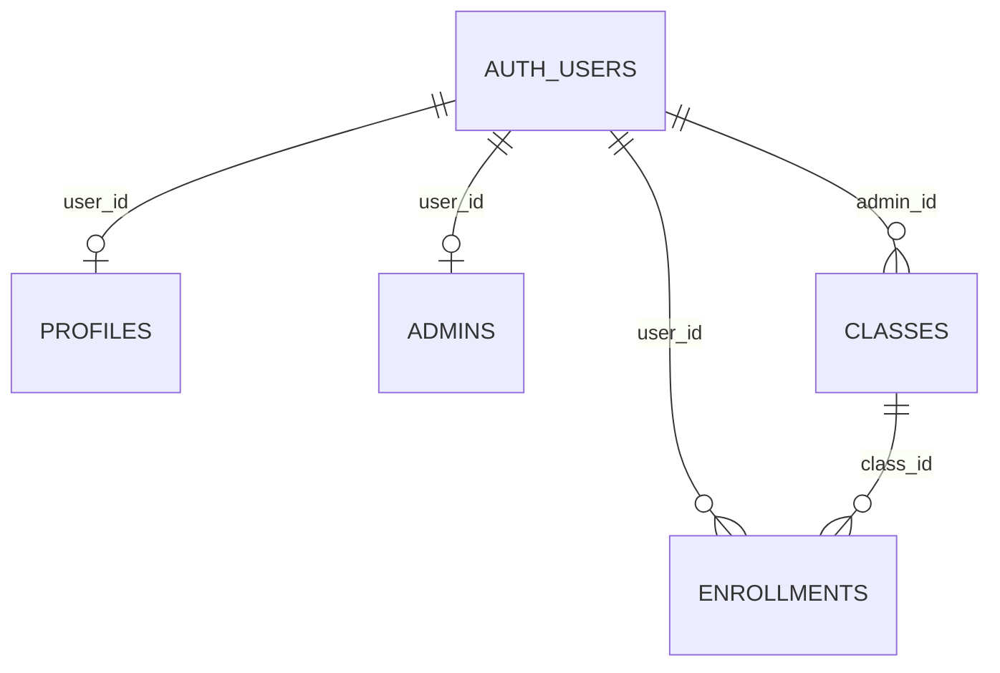

# Code Wiki：学员报名系统

本 Wiki 面向需要快速理解与维护本仓库的开发者，覆盖：整体架构、主要模块职责、关键函数/流程、依赖关系、数据库模型与 RPC、以及本地运行与部署方式。

## 1. 项目概览

- 项目目标：为培训机构提供学员报名、资料采集（含移动端图片上传）、班级管理、报名审核、资料导出、超级管理员运维的 Web 系统
- 技术栈
  - 前端：React + Vite + React Router
  - 样式：Tailwind CSS（通过 `@tailwindcss/vite`）
  - 后端：Supabase（Auth + Postgres + Storage + RPC）
  - 客户端导出：ExcelJS / jsPDF / JSZip（浏览器内生成 Excel/PDF/Zip）
- 部署形态：静态站点（建议 Netlify），后端依赖 Supabase 托管

推荐先阅读：
- 项目历史与关键问题总结：[PROJECT_SUMMARY.md](../PROJECT_SUMMARY.md)
- 移动端上传专项复盘：[UPLOAD_FIX_RETROSPECT_20260422.md](./UPLOAD_FIX_RETROSPECT_20260422.md)
- 超级管理员子域名部署说明：[SUPER_ADMIN_SUBDOMAIN_SETUP.md](./SUPER_ADMIN_SUBDOMAIN_SETUP.md)

## 2. 仓库结构

```
.
├─ docs/                         # 项目文档
├─ public/                       # 静态资源（包含导出模板 stuIm.xlsx）
├─ src/
│  ├─ components/                # 通用组件（危险删除确认弹窗）
│  ├─ contexts/                  # 三套 Auth 上下文（学员/管理员/超级管理员）
│  ├─ lib/                       # Supabase 客户端、站点 URL、常量、Excel 工具等
│  ├─ pages/                     # 页面（学员端、管理员端、超级管理员端、工具页）
│  ├─ App.jsx                    # 路由与 Provider 组装
│  └─ main.jsx                   # React 入口
└─ supabase/
   └─ migrations/                # 数据库迁移 SQL（表结构、RLS、RPC）
```

## 3. 整体架构

### 3.1 架构图（逻辑视图）

```mermaid
flowchart TB
  Browser[浏览器/移动端] --> ViteReact[React SPA (Vite)]
  ViteReact --> Router[react-router-dom 路由]
  Router --> Pages[pages/* 页面]
  Pages --> Contexts[contexts/* 登录态管理]
  Pages --> SupabaseClient[lib/supabase.js\n3个 Supabase client]

  SupabaseClient --> SupabaseAuth[Supabase Auth]
  SupabaseClient --> SupabaseDB[Supabase Postgres\n(表 + RLS + RPC)]
  SupabaseClient --> SupabaseStorage[Supabase Storage\nstudent-documents bucket]

  Pages --> Export[浏览器内导出\nExcelJS/jsPDF/JSZip]
```

### 3.2 角色与站点划分

系统存在三类角色，并在前端用“独立 Supabase client + 独立 storageKey”实现“可同时登录”：

- 学员端：`supabase`（`studentAuthStorageKey`）
- 管理员端：`supabaseAdmin`（`student-system-admin-token`）
- 超级管理员端：`supabaseSuper`（`student-system-super-token`）

对应代码：
- Supabase client 初始化与 sessionStorage 策略：[`src/lib/supabase.js`](../src/lib/supabase.js)
- 三套 Context：[`src/contexts`](../src/contexts)

## 4. 运行与入口

### 4.1 本地开发

1. 安装依赖

```bash
npm install
```

2. 配置环境变量：复制 `.env.example` 为 `.env`，并填写：
- `VITE_SUPABASE_URL`
- `VITE_SUPABASE_ANON_KEY`
- `VITE_APP_SITE_URL`（可选；未配置时运行期使用当前 origin）
- `VITE_SUPER_SITE_URL`（可选；未配置时运行期使用当前 origin）

3. 启动

```bash
npm run dev
```

4. 构建与预览

```bash
npm run build
npm run preview
```

### 4.2 路由入口一览

路由定义集中在：[`src/App.jsx`](../src/App.jsx)

- 学员
  - `/login`：学员/管理员共用登录页（通过 query `role=admin` 切换）
  - `/register`：学员注册
  - `/student/profile`：学员档案（受保护路由）
  - `/enroll/:classId`：班级报名入口（会引导注册/登录、填写档案、确认报名）
- 管理员
  - `/admin/register`：普通管理员注册
  - `/admin/dashboard`：班级管理 + 报名管理（同页 Tab）
- 超级管理员
  - `/super/login`：超级管理员登录（当前实现包含演示性质的 2FA 步骤）
  - `/super/dashboard`：管理员管理、无效账号清理、数据救援入口等
  - `/super/students`：全量学员检索、强制删除、重置密码等
- 工具
  - `/tools/excel-template-filter`：Excel 模板筛列工具

## 5. 前端模块说明

### 5.1 入口与路由层

- React 入口：[`src/main.jsx`](../src/main.jsx)
- 路由与 Provider：[`src/App.jsx`](../src/App.jsx)
  - `AuthProvider`（学员登录态）
  - `AdminAuthProvider`（管理员登录态）
  - `SuperAuthProvider`（超级管理员登录态）
  - `ProtectedRoute`：仅保护学员档案页（`/student/profile`）

### 5.2 认证与会话管理（contexts/*）

#### 5.2.1 学员：AuthContext

文件：[`src/contexts/AuthContext.jsx`](../src/contexts/AuthContext.jsx)

- 状态：`user`、`loading`
- 方法：`signUp(email,password)`、`signIn(email,password)`、`signOut()`
- 特点：启动时先从 `sessionStorage` 中“尽力恢复”用户（避免移动端返回/刷新时闪断）

#### 5.2.2 管理员：AdminAuthContext

文件：[`src/contexts/AdminAuthContext.jsx`](../src/contexts/AdminAuthContext.jsx)

- `adminSignIn` 登录后会二次校验 `public.admins` 是否存在记录，不是管理员则立即登出并报错
- Provider 渲染策略：`!loading && children`，避免认证恢复期整个树反复挂载

#### 5.2.3 超级管理员：SuperAuthContext

文件：[`src/contexts/SuperAuthContext.jsx`](../src/contexts/SuperAuthContext.jsx)

- 仅封装 `supabaseSuper` 的登录态与登出

### 5.3 Supabase 客户端与多会话策略

文件：[`src/lib/supabase.js`](../src/lib/supabase.js)

核心点：
- 三个 client 共用同一个 Supabase 项目 URL 与 anon key，但使用不同的 `auth.storageKey`
- `storage` 选用 `sessionStorage`：实现“关闭标签页/浏览器后不保留登录”
- 学员端额外提供：
  - `studentAuthStorageKey`：基于 Supabase 项目 ref 生成
  - `getStoredStudentSession/getStoredStudentUser`：在 Context 初始化阶段做“无崩溃式读取”

### 5.4 学员端关键流程

#### 5.4.1 报名入口：EnrollConfirmation

文件：[`src/pages/EnrollConfirmation.jsx`](../src/pages/EnrollConfirmation.jsx)

职责：
- 作为 `/enroll/:classId` 的入口编排页：
  1) 读取班级信息 `classes`
  2) 未登录则提供注册/登录表单（内置在页面中）
  3) 已登录则检查是否已有档案 `profiles`
  4) 已有档案则检查是否已有报名记录 `enrollments`
  5) 根据状态渲染“去填资料/确认报名/已报名/成功页”
- 缓存策略：使用 `sessionStorage` 写入 `classInfo/enrollStatus/profileId`，减少移动端“返回/重载”造成的重复查询与状态闪动

关键函数：
- `readEnrollCache/writeEnrollCache/clearEnrollCache`：报名状态缓存
- `handleAuth`：注册/登录编排（注册后会尝试自动登录）
- `handleFinishAndLogout`：报名完成后清除 session 并强制刷新

#### 5.4.2 学员档案：StudentProfile（含移动端上传稳定性）

文件：[`src/pages/StudentProfile.jsx`](../src/pages/StudentProfile.jsx)

职责：
- 学员档案表单（`profiles`）：基本信息、证件信息、联系方式、地址选择、图片上传
- 选择班级报名时，会在档案保存后写入 `enrollments`（`pending`）

关键实现点：
- 图片上传组件 `ImageUpload`
  - `getUploadPayload`：控制大小上限、判断是否进行压缩、压缩失败自动回退原图
  - `compressImage`：基于 Canvas 的压缩策略，使用 object URL 避免 base64 带来的内存压力
  - 上传目标：`storage.bucket = student-documents`，`getPublicUrl` 写回到 `profiles` 的 URL 字段
- 移动端“选图返回导致页面重载”的检测与提示
  - `setUploadSession/getUploadSessionKey/clearUploadSession`：在点击选择器/选中文件/上传失败时写 sessionStorage
  - 页面 mount 时尝试恢复并提示用户更换浏览器（微信内置/三星浏览器）
- 草稿自动保存
  - `watch` 订阅表单变化写入 `localStorage student_profile_draft_<userId>`
  - pagehide/visibilitychange 额外兜底持久化
- 上传调试面板
  - URL 增加 `?uploadDebug=1` 可打开调试日志
  - 日志写入 `localStorage student_profile_debug_log`

### 5.5 管理员端模块

#### 5.5.1 管理后台入口：AdminDashboard

文件：[`src/pages/admin/AdminDashboard.jsx`](../src/pages/admin/AdminDashboard.jsx)

职责：
- 管理后台容器页：顶部导航 + Tab 切换
- 首次挂载校验管理员身份：查询 `public.admins` 是否存在该 `user_id`
- Tab：
  - 班级管理：`ClassManagement`
  - 学员报名：`EnrollmentManagement`

#### 5.5.2 班级管理：ClassManagement

文件：[`src/pages/admin/ClassManagement.jsx`](../src/pages/admin/ClassManagement.jsx)

职责：
- CRUD 班级 `classes`（强制 `admin_id = 当前管理员 auth user.id`）
- 生成报名链接与二维码
  - `buildAppUrl`：基于 `VITE_APP_SITE_URL` 构造对外 URL
  - `QRCodeSVG`：二维码生成
- 删除班级前检查报名数（`enrollments` count）

#### 5.5.3 报名管理与导出：EnrollmentManagement

文件：[`src/pages/admin/EnrollmentManagement.jsx`](../src/pages/admin/EnrollmentManagement.jsx)

职责：
- 仅管理自己名下班级的报名记录（先取 `myClassIds`，再用 `in('class_id', myClassIds)` 过滤）
- 审核报名：更新 `enrollments.status`（pending/approved/rejected）
- 查询学员账号邮箱：
  - 优先调用 RPC `get_user_emails(user_ids[])`（避免前端直接 join `auth.users`）
  - RPC 失败则回退 `profiles.email_contact`
- 学员资料导出（浏览器内生成并下载）
  - 身份证合并为 PDF：`jsPDF`（会尝试处理 EXIF orientation）
  - 报名资料包（Excel + 证件照打包）：`ExcelJS + JSZip`
  - Excel 模板来源：`public/stuIm.xlsx`（通过 `fetch('/stuIm.xlsx')`）
- 学员密码重置：
  - 调用 RPC `reset_student_password(target_user_id,new_password)`

### 5.6 超级管理员端模块

#### 5.6.1 超级管理员登录：SuperLogin

文件：[`src/pages/super/SuperLogin.jsx`](../src/pages/super/SuperLogin.jsx)

现状说明：
- 当前实现包含“固定账号 + 二段式校验（密码 + OTP）”的演示逻辑，并包含自动初始化账号的分支；属于强运维入口，需要在生产环境进一步做安全加固与配置化（避免硬编码与前端可见口令）。

#### 5.6.2 超级管理员控制台：SuperDashboard

文件：[`src/pages/super/SuperDashboard.jsx`](../src/pages/super/SuperDashboard.jsx)

职责：
- 管理员列表与统计
  - `get_all_admins()`：拉取管理员 + 邮箱（RPC）
  - `get_admin_class_stats(target_admin_id)`：按管理员汇总班级与学员数（RPC，绕过 RLS）
- 删除管理员（级联删除班级/报名/档案）：`delete_admin_by_super(target_user_id)`（RPC）
- 重置管理员密码：`reset_user_password(target_user_id,new_password)`（RPC）
- 无效账号（僵尸用户）清理：
  - `get_zombie_users()`
  - `delete_zombie_user(target_user_id)`
  - `delete_zombie_users_batch(target_user_ids[])`
- 数据救援：`rescue_lost_classes(...)` / `find_lost_super_data(...)`（RPC）

#### 5.6.3 全量学员检索：AllStudents

文件：[`src/pages/super/AllStudents.jsx`](../src/pages/super/AllStudents.jsx)

职责：
- 调用 `get_all_students_overview()`（RPC）获取学员总览（账号、档案、班级、所属管理员等）
- 对“已备案学员”的删除动作使用二次确认组件：
  - 危险确认弹窗：[`src/components/DangerDeleteModal.jsx`](../src/components/DangerDeleteModal.jsx)
- 强制删除学员（含档案/报名/存储等）：`force_delete_student` / `force_delete_students_batch`（RPC）
- 重置学员密码：`reset_student_password`（RPC）

### 5.7 独立工具页：Excel 模板筛列工具

- 页面：[`src/pages/tools/ExcelTemplateFilterTool.jsx`](../src/pages/tools/ExcelTemplateFilterTool.jsx)
- 核心库：[`src/lib/excelTemplateFilter.js`](../src/lib/excelTemplateFilter.js)

能力：
- 读取模板 `stuIm.xlsx` 的第一行表头作为目标列集合
- 分析源 Excel 表头与模板表头的匹配情况
- 基于模板生成新 Excel：
  - 清空模板数据行
  - 按模板列顺序输出源表对应列值
  - 空行自动跳过

关键函数：
- `readTemplateHeadersFromUrl(templateUrl)`
- `analyzeSourceWorkbook(file, templateHeaders)`
- `generateWorkbookFromTemplate({ sourceFile, templateUrl })`
- `buildOutputFileName(sourceFileName)`

## 6. 数据库与后端（Supabase）

### 6.1 核心业务表（概念模型）

- `auth.users`：Supabase Auth 用户（学员/管理员/超级管理员都在这里）
- `public.profiles`：学员档案（1 个 auth 用户最多 1 条）
- `public.admins`：管理员身份表（1 个 auth 用户最多 1 条）
- `public.classes`：班级（归属某管理员：`admin_id`）
- `public.enrollments`：报名记录（`user_id` + `class_id`，防重复）

关系速记：



迁移文件位置：[`supabase/migrations`](../supabase/migrations)

### 6.2 RLS（行级安全）与多租户

数据库迁移中存在“严格隔离”和“可见性修复”两套思路的策略演进痕迹：
- 严格隔离：普通管理员只能管理自己 `admin_id` 下的 `classes/enrollments`
- 可见性修复：给所有 admins 开放 classes/enrollments 的更宽权限

实际生产应明确选择最终策略，并确保迁移顺序与最终 policy 一致。

### 6.3 关键 RPC（前端依赖）

本仓库前端直接依赖的 RPC（高频）：
- `get_user_emails(user_ids[])`：用于管理员端把 `enrollments.user_id` 映射为真实邮箱
- `reset_student_password(target_user_id,new_password)`：管理员/超管重置学员密码（包含权限校验）
- `get_all_admins()`、`get_admin_class_stats(target_admin_id)`：超级管理员控制台
- `get_all_students_overview()`：超级管理员学员总览
- `force_delete_student` / `force_delete_students_batch`：超级管理员强制删除学员
- `get_zombie_users` / `delete_zombie_user` / `delete_zombie_users_batch`：僵尸账号清理
- `delete_admin_by_super`、`reset_user_password`：管理员运维

## 7. 依赖关系与职责边界

### 7.1 关键依赖

- UI 与路由：`react`, `react-dom`, `react-router-dom`
- 表单：`react-hook-form`
- Supabase：`@supabase/supabase-js`
- 图标：`lucide-react`
- 二维码：`qrcode.react`
- 导出：`exceljs`, `jspdf`, `jszip`
- 构建：`vite`, `@vitejs/plugin-react`, `@tailwindcss/vite`, `tailwindcss`

### 7.2 依赖分层（建议理解方式）

- `pages/*`：业务流程编排与 UI
- `contexts/*`：角色登录态与 auth 操作封装
- `lib/*`：纯逻辑/工具与基础设施（Supabase client、URL 构造、Excel 工具）
- `supabase/migrations/*`：数据库结构、权限、RPC（后端能力的“唯一真相”）

## 8. 运维与排障速查

- 移动端上传异常（选图后回到上传前状态）
  - 先看专项复盘文档：[`docs/UPLOAD_FIX_RETROSPECT_20260422.md`](./UPLOAD_FIX_RETROSPECT_20260422.md)
  - 开启调试面板：页面 URL 增加 `?uploadDebug=1`
- Excel 模板相关
  - 模板文件必须在 `public/stuIm.xlsx`，否则 `/stuIm.xlsx` fetch 会失败
  - 工具页 `/tools/excel-template-filter` 可用于“源 Excel 按模板列裁剪”

